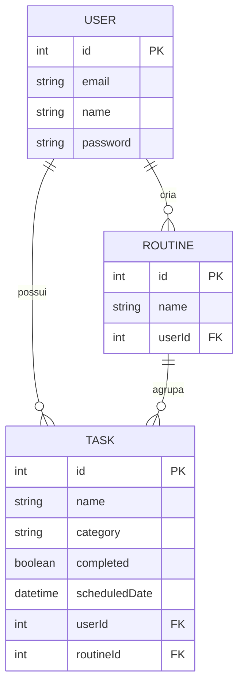

# MODELO DE DADOS (Database Schema) 📊

> Este documento descreve a estrutura das tabelas no PostgreSQL e suas relações.

## 🗄️ Entidades Principais

### 1. User (Usuários)
Armazena as informações de conta e autenticação.

| Campo | Tipo | Descrição |
| :--- | :--- | :--- |
| `id` | Int (PK) | Identificador único autoincrementado. |
| `email` | String | E-mail único (usado para login). |
| `name` | String? | Nome de exibição do usuário. |
| `password` | String | Senha criptografada (bcrypt). |
| `createdAt` | DateTime | Data de criação da conta. |

---

### 2. Routine (Rotinas)
Agrupadores de tarefas que se repetem ou pertencem a um contexto.

| Campo | Tipo | Descrição |
| :--- | :--- | :--- |
| `id` | Int (PK) | Identificador único. |
| `name` | String | Nome da rotina (ex: "Manhã Produtiva"). |
| `description` | String? | Detalhes sobre o objetivo da rotina. |
| `userId` | Int (FK) | Relacionamento com o usuário dono. |
| `createdAt` | DateTime | Data de criação. |

---

### 3. Task (Tarefas)
A unidade base do Kanban. Contém os dados de execução.

| Campo | Tipo | Descrição |
| :--- | :--- | :--- |
| `id` | Int (PK) | Identificador único. |
| `name` | String | Título da tarefa. |
| `description` | String? | Detalhes técnicos ou notas. |
| `category` | String | Categoria (Saúde, Finanças, Trabalho, etc). |
| `completed` | Boolean | Status de conclusão (default: false). |
| `scheduledDate` | DateTime | **Data de exibição no Kanban**. |
| `scheduledTime` | String? | Horário previsto (ex: "08:00"). |
| `userId` | Int (FK) | Relacionamento com o usuário dono. |
| `routineId` | Int? (FK) | Relacionamento opcional com uma rotina. |
| `completedAt` | DateTime? | Data/Hora em que foi marcada como feita. |

---

## 🔗 Diagrama de Relações (ERD)

## 📝 Observações Técnicas
- **Data do Kanban**: O frontend utiliza o campo `scheduledDate` para posicionar a tarefa na coluna correta.
- **Categorias**: Atualmente são salvas como strings. Futuramente podem virar uma tabela própria para permitir cores personalizadas.
