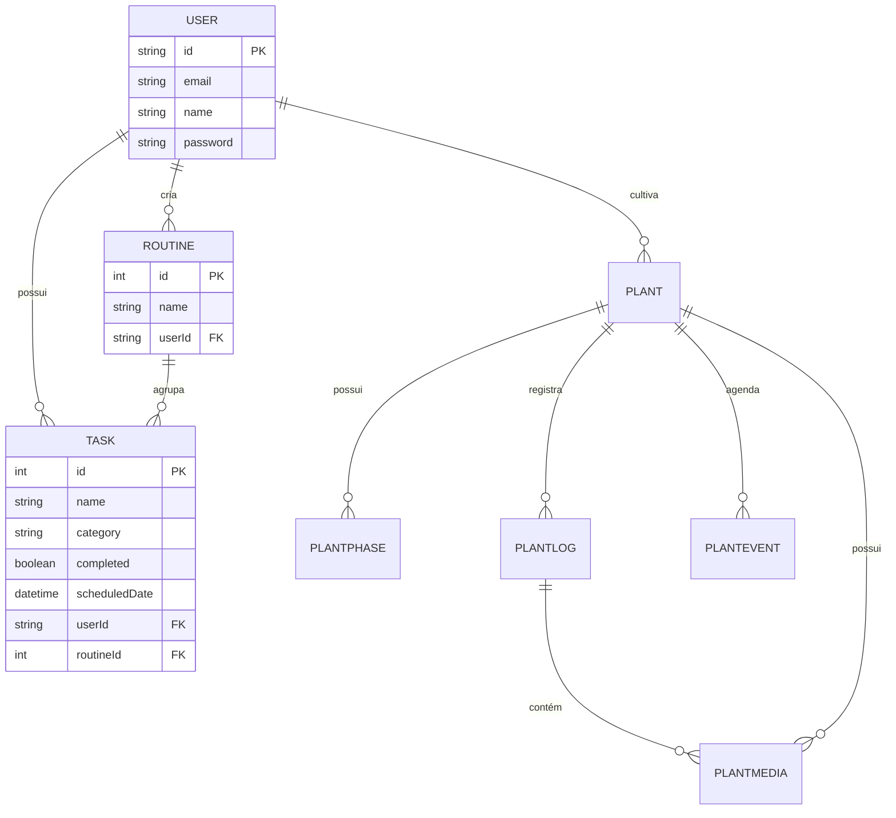

# MODELO DE DADOS (Database Schema) 📊

> Este documento descreve a estrutura das tabelas no PostgreSQL e suas relações.

## 🗄️ Entidades Principais

### 1. User (Usuários) ✅ (validado: schema.prisma)
Armazena as informações de conta e autenticação.

| Campo | Tipo | Descrição | Status |
| :--- | :--- | :--- | :--- |
| `id` | String (UUID) | Identificador único (UUID). | ✅ |
| `email` | String | E-mail único (usado para login). | ✅ |
| `username` | String? | Nome de usuário (único). | ✅ |
| `name` | String? | Nome de exibição do usuário. | ✅ |
| `password` | String? | Senha criptografada (bcrypt). | ✅ |
| `profilePhoto` | String? | URL do Avatar do usuário. | ✅ |
| `birthDate` | DateTime? | Data de nascimento. | ✅ |
| `phone`, `gender`, `timezone`, `language`, `country`, `city` | String? | Dados demográficos e de localização. | ✅ |
| `aiPersonality`, `aiGoal` | String? | Configurações da IA (Estilo e Objetivo). | ✅ |
| `planType` | String? | Tipo de plano (ex: FREE). | ✅ |
| `accountStatus` | String? | Status da conta (ex: ACTIVE). | ✅ |
| `onboardingCompleted` | Boolean | Se o usuário concluiu o tutorial inicial. | ✅ |
| `lastLoginAt` | DateTime? | Data do último login. | ✅ |
| `createdAt`, `updatedAt` | DateTime | Datas de criação e atualização. | ✅ |

---

### 2. Routine (Rotinas) ✅ (validado: schema.prisma)
Agrupadores de tarefas que se repetem ou pertencem a um contexto.

| Campo | Tipo | Descrição | Status |
| :--- | :--- | :--- | :--- |
| `id` | Int (PK) | Identificador único (autoincrement). | ✅ |
| `name` | String | Nome da rotina (ex: "Manhã Produtiva"). | ✅ |
| `category` | String | Categoria (TREINO, ESTUDO, TRABALHO, etc). | ✅ |
| `description` | String? | Detalhes sobre o objetivo da rotina. | ✅ |
| `config` | Json? | Estrutura para dias da semana, horários, etc. | ✅ |
| `isActive` | Boolean | Status da rotina (default: true). | ✅ |
| `userId` | String (FK) | Relacionamento com o usuário dono (UUID). | ✅ |
| `createdAt` | DateTime | Data de criação. | ✅ |

> **Nota:** Existe também o modelo `RoutineTemplate` para configurações padrão sugeridas (isPublic, config Json, etc).
---

### 3. Task (Tarefas) ✅ (validado: schema.prisma)
A unidade base do Kanban. Contém os dados de execução.

| Campo | Tipo | Descrição | Status |
| :--- | :--- | :--- | :--- |
| `id` | Int (PK) | Identificador único (autoincrement). | ✅ |
| `name` | String | Título da tarefa. | ✅ |
| `description` | String? | Detalhes técnicos ou notas. | ✅ |
| `category` | String | Categoria (Saúde, Finanças, Trabalho, etc). | ✅ |
| `priority` | Enum | Prioridade (BAIXA, MEDIA, ALTA). | ✅ |
| `status` | Enum | Status (PENDENTE, EM_ANDAMENTO, CONCLUIDO, CANCELADO). | ✅ |
| `tags` | String? | Tags separadas por vírgula. | ✅ |
| `completed` | Boolean | Status de conclusão (default: false). | ✅ |
| `scheduledDate` | DateTime | **Data de exibição no Kanban**. | ✅ |
| `scheduledTime` | String? | Horário previsto (ex: "08:00"). | ✅ |
| `userId` | String (FK) | Relacionamento com o usuário dono (UUID). | ✅ |
| `routineId` | Int? (FK) | Relacionamento opcional com uma rotina. | ✅ |
| `createdAt` | DateTime | Data de criação. | ✅ |
| `completedAt` | DateTime? | Data/Hora em que foi marcada como feita. | ✅ |

---

### 4. Plant System (Módulo PRO) 🌿 ✅ (validado: schema.prisma)

#### Plant (Plantas)
| Campo | Tipo | Descrição | Status |
| :--- | :--- | :--- | :--- |
| `id` | String (UUID) | Identificador único. | ✅ |
| `name` | String | Nome da planta. | ✅ |
| `species` | String? | Espécie ou linhagem. | ✅ |
| `userId` | String (FK) | Dono da planta. | ✅ |
| `germinatedAt` | DateTime? | Data de germinação. | ✅ |
| `harvestedAt` | DateTime? | Data de colheita. | ✅ |
| `createdAt` | DateTime | Data de criação do registro. | ✅ |
| `updatedAt` | DateTime | Última atualização. | ✅ |

#### PlantPhase (Fases de Cultivo)
| Campo | Tipo | Descrição | Status |
| :--- | :--- | :--- | :--- |
| `id` | String (UUID) | Identificador único. | ✅ |
| `plantId` | String (FK) | Relacionamento com a Planta. | ✅ |
| `phaseName` | String | Nome da fase (Veg, Flora, etc). | ✅ |
| `startedAt` | DateTime | Início da fase. | ✅ |
| `endedAt` | DateTime? | Fim da fase. | ✅ |
| `createdAt` | DateTime | Registro da fase. | ✅ |

#### PlantLog (Registros Diários)
| Campo | Tipo | Descrição | Status |
| :--- | :--- | :--- | :--- |
| `id` | String (UUID) | Identificador único. | ✅ |
| `plantId` | String (FK) | Relacionamento com a Planta. | ✅ |
| `title` | String | Título do log. | ✅ |
| `mood` | String | Estado (healthy, stressed, etc). | ✅ |
| `notes` | String? | Notas detalhadas. | ✅ |
| `tags` | Json? | Tags (rega, poda, etc). | ✅ |
| `loggedAt` | DateTime | Data de referência (Timeline). | ✅ |
| `createdAt` | DateTime | Criação do log. | ✅ |

#### PlantMedia (Arquivos e Fotos)
| Campo | Tipo | Descrição | Status |
| :--- | :--- | :--- | :--- |
| `id` | String (UUID) | Identificador único. | ✅ |
| `plantId` | String (FK) | Relacionamento com a Planta. | ✅ |
| `logId` | String? (FK) | Relacionamento com um Log. | ✅ |
| `url` | String | URL do arquivo (MinIO). | ✅ |
| `type` | String | Tipo (image, video, etc). | ✅ |
| `fileSize` | Int? | Tamanho do arquivo. | ✅ |
| `metadata` | Json? | Dados técnicos (Exif/IA). | ✅ |
| `createdAt` | DateTime | Data de upload. | ✅ |

#### PlantEvent (Agenda/Calendário)
| Campo | Tipo | Descrição | Status |
| :--- | :--- | :--- | :--- |
| `id` | String (UUID) | Identificador único. | ✅ |
| `plantId` | String (FK) | Relacionamento com a Planta. | ✅ |
| `type` | String | Tipo (watering, fertilization). | ✅ |
| `title` | String | Título do evento. | ✅ |
| `description` | String? | Detalhes da tarefa. | ✅ |
| `startsAt` | DateTime | Início previsto. | ✅ |
| `endsAt` | DateTime? | Fim previsto. | ✅ |
| `status` | String | Status (pending, completed). | ✅ |
| `metadata` | Json? | Dados adicionais. | ✅ |
| `createdAt` | DateTime | Registro do evento. | ✅ |

---

## 🔗 Diagrama de Relações (ERD)

## 📝 Observações Técnicas
- **Data do Kanban**: O frontend utiliza o campo `scheduledDate` para posicionar a tarefa na coluna correta.
- **Categorias**: Atualmente são salvas como strings. Futuramente podem virar uma tabela própria para permitir cores personalizadas.

---

### ⚠️ Módulo de Plantas
> **Status:** O schema acima reflete as tabelas existentes no banco de dados. O desenvolvimento dos endpoints e telas está **ATIVO** e em progresso.
